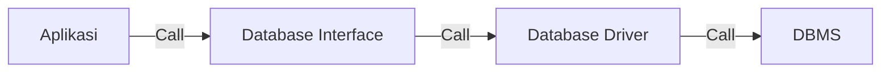

# Golang Database

----------------------
 * [Pengenalan Package Database](#pengenalan-package-database)
 * [Cara Kerja Package Database](#cara-kerja-package-database)
 * [Menambahkan Database Driver](#menambahkan-database-driver)
   * [Import Package MySQL](#import-package-mysql)
   * [Membuat Koneksi Database](#membuat-koneksi-database)
   * [Database Pooling](#database-pooling)
     * [Pengaturan Database Pooling](#pengaturan-database-pooling)
     * [Database Pooling di Go-Lang Database](#database-pooling-di-go-lang-database)

----------------------

## Pengenalan Package Database

***
* Bahasa pemrograman Go-Lang secara default memiliki sebuah package bernama database
* Package database adalah package yang berisikan kumpulan standard interface yang menjadi standard untuk berkomunikasi ke database
* Hal ini menjadikan kode program yang kita buat untuk mengakses jenis database apapun bisa menggunakan kode yang sama
* Yang berbeda hanya kode SQL yang perlu kita gunakan sesuai dengan database yang kita gunakan

## Cara Kerja Package Database
***


## Menambahkan Database Driver
***
* Sebelum kita membuat kode program menggunakan database di Go-Lang, terlebih dahulu kita wajib menambahkan driver database nya
* Tanpa driver database, maka package database di Go-Lang tidak mengerti apapun, karena hanya berisi kontrak interface saja
* https://golang.org/s/sqldrivers

```bash
$ go get -u github.com/go-sql-driver/mysql
```

### Import Package MySQL
 ```go
import (
    "database/sql"
    "fmt"
    _ "github.com/go-sql-driver/mysql"
    "testing"
)
```

### Membuat Koneksi Database
* Hal yang pertama akan kita lakukan ketika membuat aplikasi yang akan menggunakan database adalah melakukan koneksi ke database nya
* Untuk melakukan koneksi ke databsae di Golang, kita bisa membuat object sql.DB menggunakan function sql.Open(driver, dataSourceName)
* Untuk menggunakan database MySQL, kita bisa menggunakan driver “mysql”
* Sedangkan untuk dataSourceName, tiap database biasanya punya cara penulisan masing-masing, misal di MySQL, kita bisa menggunakan dataSourceName seperti dibawah ini :
username:password@tcp(host:port)/database_name
* Jika object sql.DB sudah tidak digunakan lagi, disarankan untuk menutupnya menggunakan function Close()
```go
db, err := sql.Open("mysql", "user:password@tcp(host:3306)/dbname")
if err != nil {
	panic(err)
}
defer db.Close()
```

### Database Pooling
* sql.DB di Golang sebenarnya bukanlah sebuah koneksi ke database
* Melainkan sebuah pool ke database, atau dikenal dengan konsep Database Pooling
* Di dalam sql.DB, Golang melakukan management koneksi ke database secara otomatis. Hal ini menjadikan kita tidak perlu melakukan management koneksi database secara manual
* Dengan kemampuan database pooling ini, kita bisa menentukan jumlah minimal dan maksimal koneksi yang dibuat oleh Golang, sehingga tidak membanjiri koneksi ke database, karena biasanya ada batas maksimal koneksi yang bisa ditangani oleh database yang kita gunakan

#### Pengaturan Database Pooling
| Method               | Keterangan             |
|----------------------|------------------------|
| (DB) SetMaxIdleConns(number)| Pengaturan berapa jumlah koneksi minimal yang dibuat|
| (DB) SetMaxOpenConns(number)|   Pengaturan berapa jumlah koneksi maksimal yang dibuat|
| (DB) SetConnMaxIdleTime(duration)| Pengaturan berapa lama koneksi yang sudah tidak digunakan akan dihapus|
|(DB) SetConnMaxLifetime(duration)| Pengaturan berapa lama koneksi boleh digunakan|

#### Database Pooling di Go-Lang Database
```go
db, err := sql.Open("mysql", "user:password@tcp(host:3306)/dbname")
if err != nil {
	panic(err)
}

db.SetMaxIdleConns(10)
db.SetMaxOpenConns(100)
db.SetConnMaxIdleTime(5 * time.Minute)
db.SetConnMaxLifetime(50 * time.Minute)
```